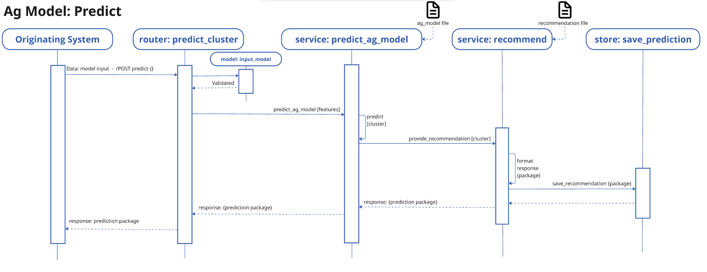
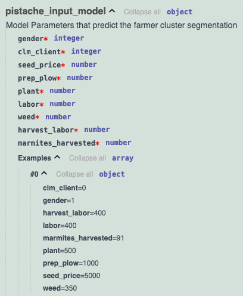

# 1.0 Problem Domain
Building on the R generated pistache ML model...
- Can the model be made available for clustering new farmer data?
- How might the prediction model be deployed in a RESTful API to identify clusters of new participating farmers?

# 2.0 Solution Vision
- Host the model and make it accessible from a RESTful API endpoint
- Allow a system to submit data via JSON (one farmer at a time)
  - Design as a JSON data solution, where data is received from a system, not from an individual User's input on a screen
- Evaluate the data and return the predicted cluster with additional insight describing the cluster and recommended action
- Store new input data with model's identified cluster to enable analysis of continued relevance and model fit

# 3.0 Implementation
## 3.1 Sequence Diagram: Predict based on System input
- See Use Case Predict for workflow steps
- 

## 3.2 Workflow
### 3.2.1 Use Case: Predict based on system input
As a System, I want to submit input ag data and receive a model prediction based on the ML model so that I might identify the cluster to which the pistache farmer might belong  
   1. Predict endpoint (in /routers/ag_model_pistache.py) receives the input data
   2. Validate input data with a model: expected data
   3. Pass validated input data to services/predict - identify cluster and return
   4. Send identified cluster and known insight added to response 
   5. Return response to System with useful information: input data, cluster, cluster description, and recommendations

### 3.2.2 Use Case: Manage model and model versions
As a Modeller, I want to retrain the ML model so that the model remains up-to-date and relevant
   1. Obtain new data - ensure it conforms with data structure
   2. Run jupyter notebook or train_ML_mdoel.py to evaluate and generate a new model file
   3. Problem: I need to be careful and intentional with model versioning 
        - Therefore, I need a routine to backup existing files and differentiate with the version date
      1. Create model file format with datestamp, indicating versioning
      2. Utilize model config YAML file to identify which model file version to use. This allows to rapidly change the model file by referencing which file to use in a config file, not the source code
      3. Create config management process to manage model creation and file versioning
   4. Run application and test to ensure the new model is loaded into the system and the system performs as expected

### 3.2.3 Use Case: Monitor model Performance
As a Modeler, I want to monitor model performance and fit based on system submitted data and derived predictions so that the model can be tuned and modified when necessary (aka: How will I know when to update the model?)
    1. Store system submitted data along with predicted cluster results
    2. Periodically retrieve and analyze data to assess model fitness

## 3.3 Ag Model input model
1. API endpoint
   - POST /predict

2. Model Schema
- 

3. Example 1:  payload results in Cluster 1
```json
{
  "clm_client": 0,
  "gender": 1,
  "harvest_labor": 400,
  "labor": 400,
  "marmites_harvested": 91,
  "plant": 500,
  "prep_plow": 1000,
  "seed_price": 5000,
  "weed": 350
}
```
```curl
curl -X 'POST' \
  'http://127.0.0.1:8000/predict' \
  -H 'accept: application/json' \
  -H 'Content-Type: application/json' \
  -d '{
  "clm_client": 0,
  "gender": 1,
  "harvest_labor": 400,
  "labor": 400,
  "marmites_harvested": 91,
  "plant": 500,
  "prep_plow": 1000,
  "seed_price": 5000,
  "weed": 350
}'
```

# 4.0 Outcomes
## 4.1 Learnings
